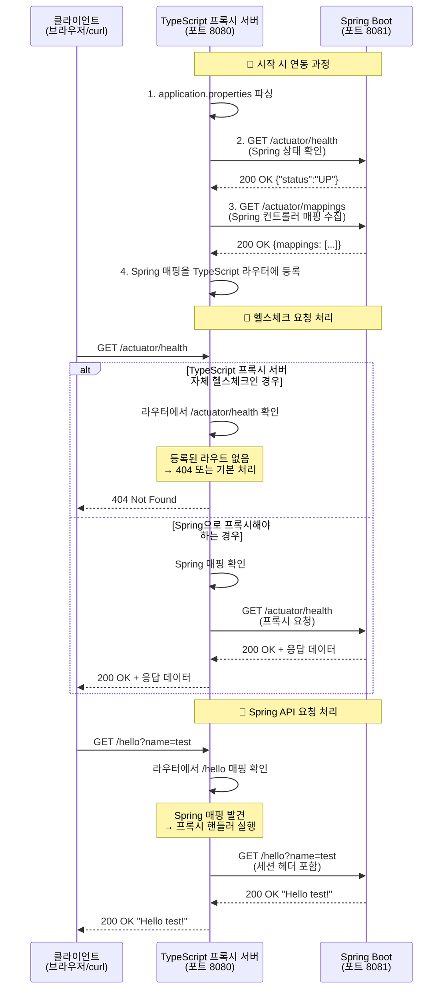

# My TypeScript Proxy Server

TypeScript로 개발하는 프록시 서버 프로젝트입니다.

## 목표

- Spring Framework와 연동하여 사용할 수 있는 프록시 서버 구현
- TypeScript를 사용하여 개발

## 개발 환경

- Node.js
- TypeScript

## 프로젝트 구조

```
my_typescript_proxy_server/
├── src/              # 소스 코드 루트
│   ├── core/         # HTTP 서버, 요청/응답 처리 등 핵심 로직
│   ├── servlet/      # 서블릿 컨테이너 관련 구현
│   ├── spring/       # Spring Framework 연동 관련 구현
│   └── utils/        # 유틸리티 함수
├── tests/            # 테스트 코드
├── dist/             # 컴파일된 JavaScript 파일 (빌드 후 생성)
├── node_modules/     # Node.js 모듈 (npm install 후 생성)
├── package.json      # 프로젝트 설정 및 의존성 관리
├── tsconfig.json     # TypeScript 컴파일 설정
├── README.md         # 프로젝트 개요 (현재 파일)
├── PRD.korean.md     # 요구사항 정의서 (한국어)
├── PRD.english.md    # 요구사항 정의서 (영어)
└── NEW_FILE_REQUESTS.md # 파일 생성 요청 기록
```

## 관련 문서

- [요구사항 정의서 (한국어)](PRD.korean.md)
- [Project Requirements Document (English)](PRD.english.md)

## 구현 내용

- ✅ 기본 HTTP 요청/응답 처리 구현 (Request/Response 추상화)
- ✅ 기본 라우팅 시스템 구현 (Router, Route 클래스)
- ✅ 서블릿 컨테이너 기능 구현 (ServletContainer, HttpServlet)
- ✅ **Spring Framework 연동 브릿지 구현** (SpringBridge, ConfigParser, SessionManager)

## Spring Framework 연동

### 개요
TypeScript 프록시 서버는 HTTP 프록시 방식으로 Spring Framework 애플리케이션과 연동됩니다:
- **TypeScript 프록시 서버**: 포트 8080 (프론트엔드 프록시 역할)
- **Spring Application**: 포트 8081 (백엔드 애플리케이션 역할)

### 주요 기능

#### 1. 자동 Spring 컨트롤러 매핑
- Spring Boot Actuator의 `/actuator/mappings` 엔드포인트에서 메타데이터 수집
- `@RequestMapping`, `@GetMapping` 등의 Spring 컨트롤러 경로를 자동으로 TypeScript 프록시 서버 라우터에 등록
- 클라이언트 요청을 적절한 Spring 컨트롤러로 프록시

#### 2. 설정 파일 통합
- `application.properties` 파일 자동 파싱
- 환경 변수 오버라이드 지원
- Spring 애플리케이션 포트, 컨텍스트 경로 등 설정 동기화

#### 3. 세션 관리
- TypeScript 프록시 서버와 Spring 간 세션 정보 공유
- 쿠키 기반 세션 ID 관리
- Spring Security 인증 정보 동기화
- 메모리/Redis 기반 세션 저장소 지원

#### 4. 헬스체크 및 자동 재연결
- Spring 애플리케이션 상태 주기적 모니터링
- 연결 실패 시 자동 재시도
- Spring 재시작 시 자동 재연결 및 메타데이터 갱신

### 사용 방법

#### 🚀 빠른 시작 (통합 실행)
```bash
# Spring Boot + TypeScript 프록시 서버 동시 실행
./start-all.sh
```

#### 🔧 개별 실행
1. **Spring Boot 애플리케이션 실행** (터미널 1)
   ```bash
   # Spring Boot만 실행
   ./start-spring.sh
   
   # 또는 수동으로
   cd spring_example
   ./gradlew bootRun
   ```

2. **TypeScript 프록시 서버 실행** (터미널 2)
   ```bash
   npm run dev
   ```

#### 📋 연동 확인
- **TypeScript 프록시 서버**: http://localhost:8080
- **Spring Boot**: http://localhost:8081
- **Spring Health Check**: http://localhost:8081/actuator/health
- **Spring API 매핑**: http://localhost:8081/actuator/mappings

#### 🌸 Spring Boot 엔드포인트 (프록시됨)
- `GET /hello?name=이름` - Spring Boot Hello API
- `GET /posts` - 게시글 목록 조회
- `POST /posts` - 게시글 생성
- `GET /posts/{id}` - 게시글 상세 조회
- `PUT /posts/{id}` - 게시글 수정
- `DELETE /posts/{id}` - 게시글 삭제

### 아키텍처
```
클라이언트 요청
      ↓
TypeScript 프록시 서버 (8080)
├── 정적 파일 처리
├── 세션 관리
├── Spring 매핑 확인
└── Spring 프록시 (8081)
      ↓
Spring Application
├── @RestController
├── @Service
├── @Repository
└── 비즈니스 로직
```

### 연동 동작 과정

#### 🔄 시작 시 연동 과정 및 요청 처리 흐름



#### 📋 연동 과정 상세 설명

1. **초기 연동 설정**:
   - TypeScript 프록시 서버가 시작되면 `spring_example/src/main/resources/application.properties` 파일을 파싱
   - Spring Boot 애플리케이션의 포트(8081), Actuator 엔드포인트 경로 등을 확인

2. **Spring Boot 상태 확인**:
   - `/actuator/health` 엔드포인트로 Spring Boot 애플리케이션이 실행 중인지 확인
   - 연결 실패 시 최대 3회까지 재시도

3. **컨트롤러 매핑 수집**:
   - `/actuator/mappings` 엔드포인트에서 Spring Boot의 모든 컨트롤러 매핑 정보 수집
   - `@GetMapping`, `@PostMapping` 등의 어노테이션으로 정의된 경로들을 자동 감지

4. **동적 라우트 등록**:
   - 수집한 Spring 매핑을 TypeScript 프록시 서버의 라우터에 프록시 핸들러로 등록
   - 클라이언트 요청이 들어오면 해당 경로를 Spring Boot로 전달

5. **요청 프록시 처리**:
   - 클라이언트 요청을 받으면 먼저 TypeScript 프록시 서버 자체 라우트 확인
   - Spring 매핑이 있으면 세션 정보와 함께 Spring Boot로 프록시
   - Spring Boot 응답을 클라이언트에게 그대로 전달

## 테스트

### 테스트 실행
```bash
# 모든 테스트 실행
npm test

# 테스트 watch 모드 (파일 변경 시 자동 재실행)
npm run test:watch

# 테스트 커버리지 확인
npm run test:coverage
```

### 테스트 종류
- **API 테스트** (`test/api.test.ts`): 실제 HTTP 요청/응답 테스트
- **Router 테스트** (`test/router.test.ts`): 라우팅 시스템 단위 테스트

### 테스트 결과
- ✅ 15개 테스트 모두 통과
- 📊 테스트 커버리지: 58.06% (핵심 로직 위주)
